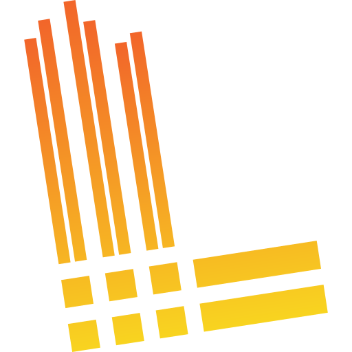
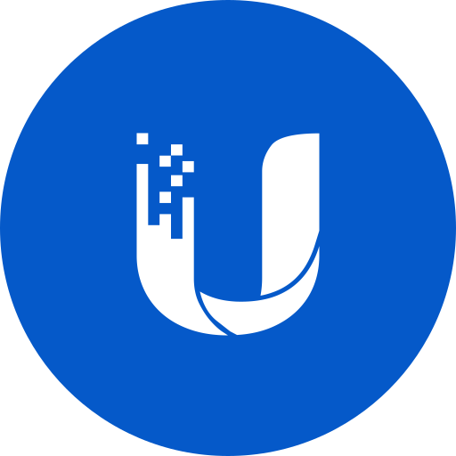
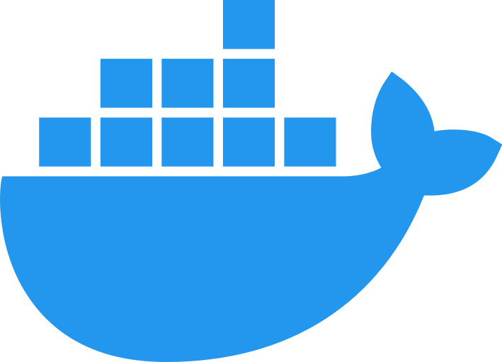

# 🛡️ Stefans - Homelab

Dieses Repository dokumentiert den schrittweisen Aufbau meines privaten Homelabs zu einer realitätsnahen Testumgebung, die typische Enterprise-Infrastruktur abbildet: Virtualisierung, Netzwerk, Windows-/Linux-Systeme, Monitoring und perspektivisch
Security-Detection.
Ziel ist es, eine private, praxisnahe Umgebung zum Lernen, Testen und Entwickeln aufzubauen, die langfristig verschiedene Szenarien aus den Bereichen IT-Infrastruktur und IT-Security ermöglicht.


<sub>*Bild KI-generiert.*</sub>

> **Hinweis:** Dieses Repository befindet sich in aktiver Entwicklung. Dokumentation und README werden fortlaufend erweitert und aktualisiert. Es kann vorkommen, dass einzelne Komponenten bereits umgesetzt, aber noch nicht vollständig dokumentiert sind. Ich bemühe mich, den Stand zeitnah nachzuziehen.


# 🖥️ Server

Als Basis und zum Start des Projekts dient mein alter Gaming-PC als Virtualisierungshost (Server 1). Die Hardware reicht für den aktuellen Scope aus, ohne dass eine Neuanschaffung nötig war. Für Backups und co. soll hier zeitnah ein NAS als zweiter Server folgen.
Als Monitoring-Server dient ein NUC der 7. Generation (Server 2). Auf diesem läuft ein Headless Debian, der Monitoring Stack wird über Docker-Container bereitgestellt. Für Details siehe [mon01 - Monitoring Host](/docs/mon01%20-%20Monitoring%20Host.md).


## 💻 Server 1 - Proxmox Host

- CPU: Intel Core i7-9700K
- RAM: G.Skill Trident Z 32 GB 3200MHz DDR4 (2 x 16 GB)
- GPU: Zotac RTX 3070 Ti 8 GB VRAM
- Motherboard: ASUS ROG STRIX Z390-I GAMING
- Storage:
  - Samsung SSD 970 EVO Plus 256 GB NVMe (Proxmox OS)
  - SanDisk SSD 2 TB SATA (Storage für VMs und Container)
  - Western Digital HDD 2 TB SATA (ISOs und Backups -> vorübergehend)
- Gehäuse: Corsair Crystal 280X


## 💻 Server 2 - Monitoring Host

- CPU: Intel Core i5-7260U
- RAM: 16 GB SODIMM 3200 mhz DDR4
- Storage: Kingston SSD 240 GB NVMe


# 🌐 Netzwerk

**Hardware:**
- UniFi Cloud Gateway Ultra
- UniFi U7 Lite

Das Heimnetz ist per VLAN in mehrere Bereiche unterteilt (Trusted, IoT, Gäste, Homelab). Dafür gibt es ein eigenes **Homelab-VLAN (VLAN 40, `10.0.40.0/24`)**, über eine zonenbasierte Firewall vom restlichen Heimnetz getrennt: Das Homelab-Netz ist standardmäßig komplett isoliert,
eine gezielte Regel erlaubt ausschließlich dem Trusted-Netz initiativen Zugriff. Umgekehrt kann das Homelab-Netz von sich aus nichts im übrigen Heimnetz erreichen.


# 🔀 Reverse Proxy & Fernzugriff

Alle Web-Dienste laufen hinter einem zentralen Reverse Proxy ([Caddy](https://caddyserver.com/)) in einem eigenen LXC. Er stellt ein öffentlich vertrauenswürdiges Let's-Encrypt-Wildcard-Zertifikat bereit, das per DNS-01-Challenge ausgestellt wird. Dafür muss kein Dienst aus dem Internet erreichbar sein, und alle Geräte vertrauen den Zertifikaten ohne eigene CA.

Von unterwegs geht der Zugriff ausschließlich über das WireGuard-VPN des Gateways. Die VPN-Zone darf dabei nur den Reverse Proxy erreichen, nicht das restliche Homelab. Details siehe [proxy01 - Reverse Proxy](/docs/proxy01%20-%20Reverse%20Proxy.md).


# 📈 Monitoring

Zentrale Überwachung von Host und Gastsystemen über Prometheus und Grafana. Details siehe [mon01 - Monitoring Host](/docs/mon01%20-%20Monitoring%20Host.md).


<sub>*Grafana-Dashboard_v2*</sub>


# 🧰 Tech-Stack

| Logo | Name | Beschreibung |
|:---:|---|---|
|  | [Proxmox](https://www.proxmox.com/) | Virtualisierungsplattform |
|  | [Debian](https://www.debian.org/) | Linux-Distribution |
|  | [Prometheus](https://prometheus.io/) | Toolkit für Systemüberwachung und Alerting |
|  | [Grafana](https://grafana.com/) | Überwachungs-Oberfläche |
|  | [Loki](https://grafana.com/oss/loki/) | Log-Aggregationssystem für zentrales, LAN-internes Logging |
|  | [Alloy](https://grafana.com/docs/alloy/) | Log-Sammler, liest lokale Logs und pusht sie an Loki |
|  | [UniFi](https://ui.com) | Netzwerk-Infrastruktur (Router, Access Point, VLAN-Segmentierung) |
|  | [Docker](https://www.docker.com) | Containerisierungsplattform für Anwendungen |
|  | [Alertmanager](https://prometheus.io/docs/alerting/latest/alertmanager/) | Verarbeitet und leitet Alerts von Prometheus weiter |
|  | [Caddy](https://caddyserver.com/) | Reverse Proxy mit automatischem HTTPS |
|  | [Let's Encrypt](https://letsencrypt.org/) | Kostenlose, öffentlich vertrauenswürdige TLS-Zertifikate |
|  | [WireGuard](https://www.wireguard.com/) | VPN für den Fernzugriff |


# 📁 Repo-Struktur

```
homelab/
├── README.md                       # Projektüberblick
├── assets/
│   ├── images/
│   ├── logos/
│   └── screenshots/
├── configs/                        # Caddy-, Grafana-, Prometheus- und Proxmox-Konfigurationen
│   ├── caddy/
│   ├── grafana/
│   ├── prometheus/
│   └── proxmox/
└── docs/                           # Technische Komponenten-Doku (Konfigurationen, relevante Befehle, offene Punkte, etc.)
    ├── Host, VM- und Container-Übersicht.md
    ├── pve01 - Proxmox Host.md
    ├── mon01 - Monitoring Host.md
    └── proxy01 - Reverse Proxy.md

```


# 📚 Dokumentation

| Komponente | Doku |
|---|---|
| Übersicht aller Hosts, VMs und Container | [Host, VM- und Container-Übersicht](/docs/Host,%20VM-%20und%20Container-%C3%9Cbersicht.md) |
| Proxmox-Host | [pve01 - Proxmox Host](/docs/pve01%20-%20Proxmox%20Host.md) |
| Monitoring & Logging | [mon01 - Monitoring Host](/docs/mon01%20-%20Monitoring%20Host.md) |
| Reverse Proxy & TLS | [proxy01 - Reverse Proxy](/docs/proxy01%20-%20Reverse%20Proxy.md) |


# 📬 Kontakt

Bei Fragen, Anregungen, Tipps oder Anmerkungen erreichst du mich gerne über [LinkedIn](https://www.linkedin.com/in/stefan-höger-5a375a339/) oder [XING](https://www.xing.com/profile/Stefan_Hoeger049861/web_profiles?nwt_nav=profile).

Über Rückmeldungen und Austausch freue ich mich immer.
